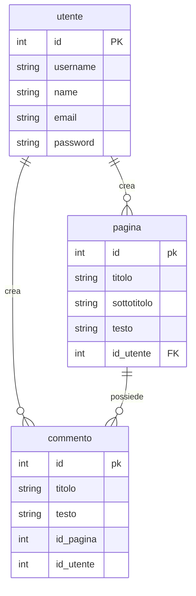

```mermaid
    erDiagram
    utente ||--o{ pagina : "crea"
    utente ||--o{ commento : "crea"
    pagina ||--o{ commento : "possiede"

    utente {
        int id PK
        string username
        string name
        string email
        string password
    }

    pagina {
        int id pk
        string titolo
        string sottotitolo
        string testo
        int id_utente FK
    }

    commento {
        int id pk
        string titolo
        string testo
        int id_pagina
        int id_utente
    }
```